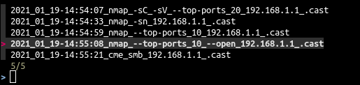
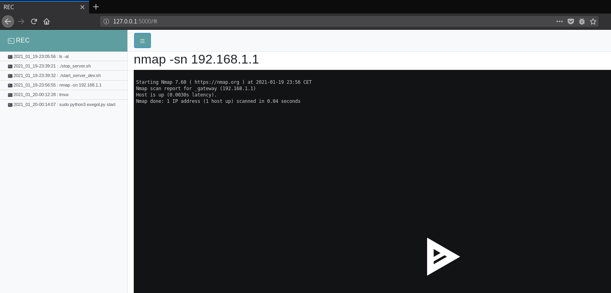

# REC

rec is a simple tool to quickly record and browse asciinema records.
I use it to quickly launch record on commands during pentest assestment.

## usages :

- start a command and record it :
```
rec <command>
```

- play recorded command :
```
rec_play
```



- browse commands start server :
```
rec_browse_start
```

This launch a python server on http://127.0.0.1:5000/




- browse command stop server :
```
rec_browse_stop
```

- clean commands recorded
```
rec_clean
```

- launch rec for multiples commands with a name (juste like asciinema)
```
rec_start <record_name>
```
(type ctrl+D or exit to exit)

## prerequistes 

- You need :
 - asciinema
 - fzf 
 - docker (to run flask server)

In order to run the application as intented
